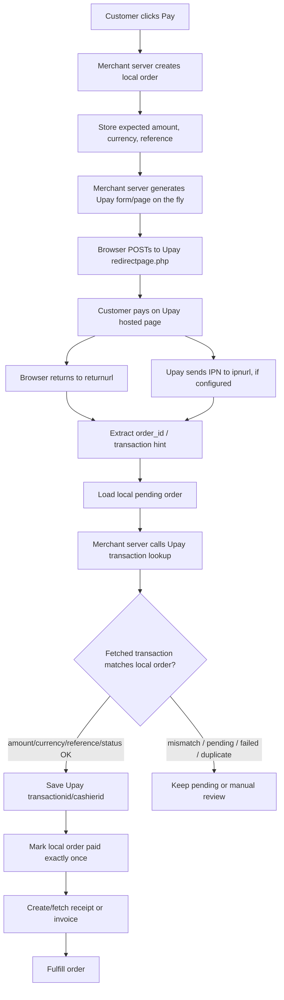

# Upay Website Payment Flow — Scoped Merchant Documentation

This file documents only the website payment flow and the merchant actions around it: verify what was paid, refund/cancel, and create/download receipts or invoices.



## In scope

- Website payment form/button/hosted page checkout.
- `returnurl` and separate `ipnurl` handling.
- Transaction lookup and verification.
- Refund/cancellation by `cashierid`.
- Receipt/invoice creation and download.

## Out of scope

- Direct in-app payments.
- Extensive reports/dashboards.
- Account updates and user profile APIs.
- Bank/account details and back-office management APIs.

## Flow notes

1. Your API/server creates the payment page/form dynamically.
2. The browser posts to Upay.
3. Upay handles card/payment collection.
4. Your server does not trust browser-only return parameters.
5. Your server calls Upay lookup to verify the transaction.
6. Your server optionally creates or retrieves receipt/invoice documents.


## Callback/IPN trust model

Use `returnurl` and `ipnurl` only as triggers.

The notification should help your server identify which local order or Upay transaction to check, but it should not be treated as proof of payment.

Recommended verification chain:

```text
notification received
→ get order_id / transactionid / cashierid hint
→ load local pending order
→ fetch Upay transaction server-to-server
→ match fetched transaction to local order
→ verify amount, currency, status, merchant/account, and duplicate use
→ save Upay transaction id
→ mark paid once
```

Because the final decision is based on authenticated server-side lookup, callback signing/HMAC is helpful but not mandatory for correctness. A fake callback can only trigger a lookup; it cannot create a valid paid transaction in Upay.

Recommended local fields:

| Field | Why |
|---|---|
| `order_id` | Your local order identity. |
| `payment_reference` | Stable reference to put in URLs/payment details where possible. |
| `expected_amount` / `expected_currency` | Values to compare against Upay lookup. |
| `upay_transaction_id` / `upay_cashierid` | Saved after lookup; enforce uniqueness. |
| `upay_status` / `upay_verified_at` | Audit trail for the verification result. |
| `paid_at` | Set only after verification passes. |

## Safe fulfillment rule

Until Upay confirms otherwise, use only `S` as the automatic paid/final status.

Treat `A` as approved/accepted but not necessarily final unless Upay confirms it is final for your website-card-payment flow.
